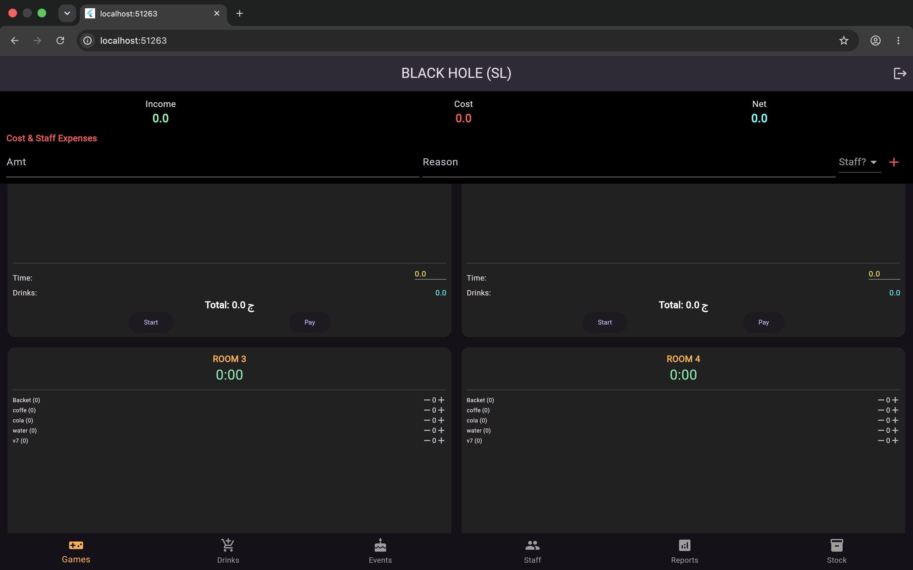
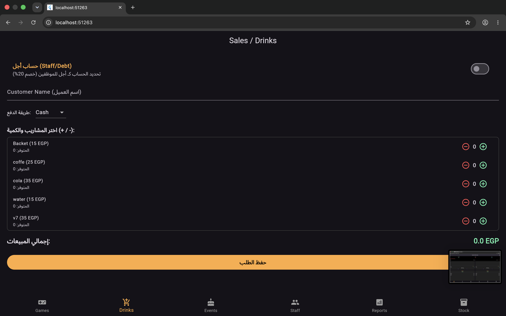
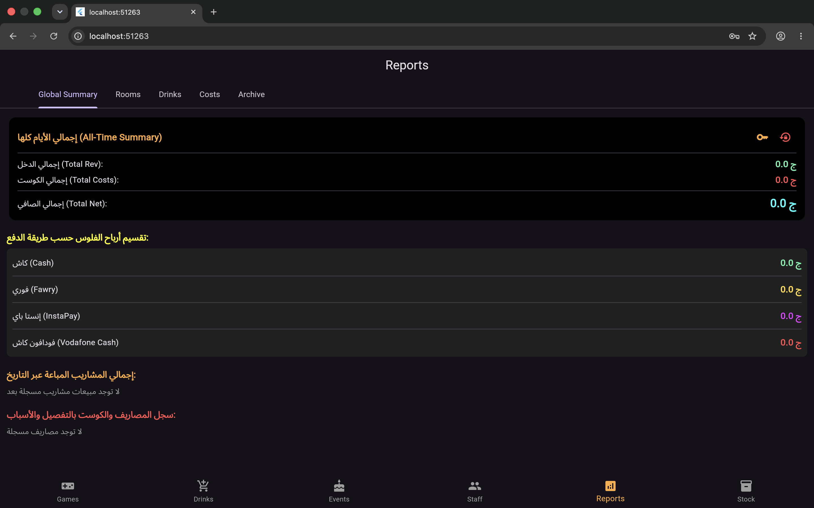
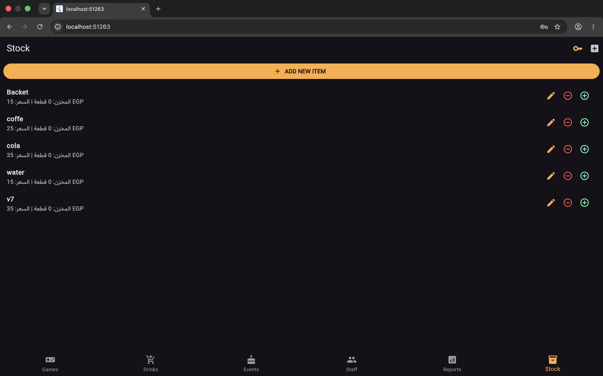

# ☕ Cafe & PlayStation Lounge Management System

A comprehensive and efficient desktop/mobile management application designed for cafes and PlayStation lounges to track room sessions, manage orders, handle inventory, and generate daily financial reports.

---

## 📸 Screenshots

| Room & Session Management | Orders & Inventory |
| :---: | :---: |
|  |  |

| Financial Reports & Analytics | Stock Tracking |
| :---: | :---: |
|  |  |

---

## 🚀 Key Features

- ⏱️ **PlayStation Room & Timer Management:** Real-time timer tracking, room state handling, and automated pricing calculation per session.
- 🍹 **POS & Inventory Tracking:** Quick menu ordering, automated stock reduction, and instant receipt total calculation.
- 💸 **Expense Logger:** Simple logging for daily operational expenses to accurately track net revenue.
- 📊 **Daily Financial Reports:** Comprehensive summaries of daily earnings, expenses, and net profit.

---

## 🛠️ Tech Stack

- **Framework:** Flutter (Android / Desktop / Web)
- **Language:** Dart
- **Database:** Local Storage (Hive / Shared Preferences / Sqflite)
- **Architecture:** Clean & Scalable Structure